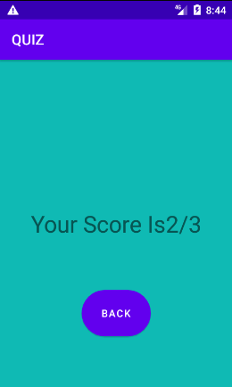

# QUIZ
This is android application which is developed through java. At when running this application, main activity will open.
In this activity there one button knows as start button. When we click the start button, then quiz activity will open in where different question will appear. 
The quiz question will display in the activity_quiz. Then the users have to find the correct answer to collect marks.
After choosing answer When user click on final submitted quiz then goes to next score board for total question with total point. 
In this application, 1 marks for one correct answer. The different question with multiple answer were given below in figure.

 
After clicking the final submit then score board will appear which is show in below figure, 
this activity is knows as score activity. The total score will give in this activity.In this page the total marks solved from quiz list page shown calculated here.

